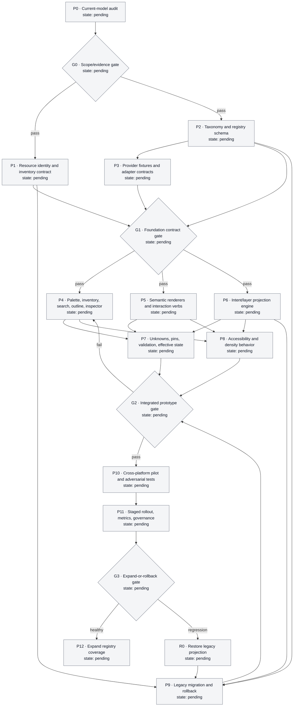

debate-protocol: 2
debate-scope: direct
debate-version: v0

# Product decision

Maintain one authoritative inventory of every resource, but render each architecture diagram as an intent-specific projection driven by validated resource semantics; only topology-relevant resources become nodes, while scopes, attachments, policies, relationships, details, and documentation pins receive distinct representations or remain inventory-only.

# 1. Separate resource truth from diagram presentation

The product needs four related but independent planes:

1. **Resource plane — authoritative truth.** One record per provider/imported resource identity, containing type, provider ID, configuration, lifecycle state, provenance, and authorization. A diagram never owns or duplicates this record.
2. **Metadata plane — semantic contract.** A versioned registry entry for each supported resource type declares what the type means, where it can apply, and how it may appear in each diagram intent. Provider adapters supply provider-specific target, scope, cardinality, inheritance, selector, and effective-state behavior.
3. **Projection plane — saved diagram.** A diagram stores its intent, references to resource IDs, representation/layout state, enabled layers, annotations, documentation pins, and migration metadata. It never becomes a second source of resource configuration.
4. **Effective-state plane — derived evidence.** Provider-resolved attachments, selectors, inheritance, and effective policy are time-stamped and carry provenance. Configured, effective, stale, pending, unknown, and unsupported states must not be conflated.

A shared resource may produce several association badges—for example, one security policy applied to several targets—but every badge references the same authoritative ID. It does not create copied resources.

# 2. Presentation taxonomy

Resource role and diagram representation are separate dimensions. A type has a default role plus permitted intent-specific projections.

| Semantic role | Default representation | Typical examples |
|---|---|---|
| `topology_node` | Node | VM, database, load balancer, queue, traffic-processing gateway |
| `container_scope` | Boundary/container | VNet/VPC, Subnet, project, namespace |
| `attachment` | Badge on a confirmed target | NSG, AWS Security Group, route table, WAF policy |
| `selector_policy` | Scope/selector summary; optional overlay | GCP firewall rule, Kubernetes NetworkPolicy, Intune assignment |
| `inherited_policy` | Inheritance/coverage summary in a relevant layer | Azure Policy, GCP Organization Policy, hierarchical firewall policy |
| `typed_relationship` | Inspector row or optional typed edge | Role assignment, VNet link, policy association |
| `child_configuration` | Parent inspector/outline | Individual rules, routes, IP configurations, listener rules |
| `operational_artifact` | Inventory/inspector; node only in an authorized intent | Diagnostic settings, backup policies, alerts, log destinations |
| `metadata_administrative` | Inspector/inventory | Tags, locks, quotas, administrative assignments |
| `ephemeral_derived` | Parent summary or temporary layer | Generated endpoints, transient revisions, resolved members |
| `unknown_unsupported` | Inventory plus explicit warning; never auto-placed | Newly released, custom, stale-metadata, or unclassified types |

Allowed projection classes are `node`, `boundary`, `badge`, `overlay`, `typed_edge`, `inspector_only`, `inventory_only`, and `documentation_pin`. A registry entry may authorize different classes by intent: a centralized logging service can be inspector-only in a Runtime view but a real data-flow node in an Operations view. This is an explicit semantic override, not a user-controlled change of resource truth.

# 3. Deterministic classification and visibility resolution

Apply this decision tree:

1. Resolve the exact provider/type key and the diagram’s pinned registry version.
2. If metadata is missing, incompatible, unsupported, stale beyond policy, or below its required evidence confidence, classify as `unknown_unsupported`. Keep it searchable and inspectable; block automatic placement and relationship creation.
3. Read the validated default semantic role and provider rules. Never infer role from display name, icon, or a visually adjacent legacy edge.
4. Resolve the current diagram intent and any registry-authorized intent-specific projection.
5. Apply validated instance facts such as actual parent, target, selector, or imported provider ID. Instance data may choose among registry-authorized states; it may not invent a new semantic role.
6. Apply enabled view layers as temporary disclosure filters.
7. Apply an explicit documentation pin, if allowed. A pin adds a labelled reference; it never changes semantic role, gains generic ports, or creates an unvalidated relationship.
8. Resolve configured versus effective state and show provenance/staleness. Failure to resolve effective state never changes unknown into healthy.

Resolution order is therefore:

```text
resource identity → registry semantics → validated instance facts
→ diagram intent → temporary layers → safe documentation pin
→ effective-state evidence
```

# 4. Diagram intents and layers

The default is **Runtime architecture**. It shows topology nodes, necessary containment, typed runtime relationships, and compact high-signal attachment summaries. It excludes child configuration, administrative metadata, most operational artifacts, and standalone policy cards.

Supported initial intent presets:

- **Runtime** — compute, data, messaging, ingress/egress, failure and data-flow boundaries.
- **Network** — networks, subnets, routing, endpoints, attachments, and effective connectivity.
- **Security** — protection attachments, selector policies, inheritance, trust boundaries, and effective-policy provenance.
- **Identity & governance** — IAM/RBAC, assignments, organizational policies, scopes, and inheritance.
- **Operations & resilience** — monitoring/log flows, alerts, backups, recovery, diagnostic destinations, and dependencies.

These are projections of the same inventory, not independent diagrams of duplicated resources. A view switch hides or reveals references but does not create, delete, attach, or mutate resources. Layout state is stored per intent/layer projection so returning to a view restores its layout. If a change cannot be represented losslessly, switching stops and offers `Keep current view`, `Save projection`, or `Discard uncommitted layout`.

An **All resources** mode is a table/tree inventory and export, not a free-form node canvas. That preserves completeness without legitimizing an inventory dump as architecture.

# 5. Product surfaces and semantic verbs

## Type palette

The current universal copy `Click to add · drag to position` is replaced by a role-aware action:

- `Place` — topology node.
- `Add scope` — container/boundary.
- `Create and attach` — attachment resource with valid targets highlighted.
- `Create and assign` — selector/scoped/inherited policy with a target/scope builder.
- `Add to parent` — child configuration.
- `Configure` or `Inspect` — inventory/inspector-only type.
- `Pin reference` — safe documentation override where permitted.

Drag-position is available only for free-positioned nodes, boundaries, and documentation references. Attachment badges, child configuration, inherited summaries, and selector overlays derive their position from their target/scope.

The palette defaults to types relevant to the selected diagram intent, but `All types` search remains available and explains why a type is not normally placed.

## Resource inventory

The Inventory tab/tree is authoritative for instantiated resources. It includes visible, hidden, unattached, unknown, imported, unresolved, ephemeral, and provider-unverified records. Search/filter dimensions include provider, type, semantic role, scope, state, diagram presence, layer, attachment count, and classification confidence.

Inventory actions include `Inspect`, `Locate`, `Reveal relevant layer`, `Attach/assign` where valid, `Pin reference`, and `Request classification`. `Locate` either focuses an existing projection or explains that the resource is inventory-only and offers a safe next action.

## Canvas and outline

The canvas contains specialized renderers: nodes, boundaries, target badges, selector/inheritance summaries, typed edges, focused overlays, and documentation references. It never gives every record a generic card and four arbitrary handles.

The accessible outline is the non-spatial equivalent of the canvas. It lists visible structure, association/inheritance summaries, and counts of resources hidden by intent/layer, with locate/reveal actions. No relationship exists only as geometry.

## Inspector and search

The inspector distinguishes `Resource`, `Configured`, `Effective`, `Associations`, `Diagnostics`, and `Diagram reference`. It shows provenance, target/scope semantics, cardinality, inheritance, selector resolution, staleness, authorization, blast radius, and the reason for current visibility.

Global search indexes both resource types and authoritative instances. Results announce the correct verb and default representation rather than always offering `Add to canvas`.

# 6. Safe documentation pins

Pinning solves legitimate documentation needs without undoing the semantic model:

- a pin is a diagram reference with resource ID, label, reason, and optional note;
- it uses an annotation/reference shape, never the provider’s topology-node card;
- it states `Documentation reference — not a runtime hop` in its accessible name/inspector;
- it has no generic ports and accepts only registry-confirmed typed documentation relationships;
- pinning does not change type classification or resource configuration;
- sensitive types can deny pinning or expose only redacted metadata; secret/certificate values are never placed;
- unknown types may be pinned only as `Unclassified reference`, with no edges and a visible classification warning.

The product records the pin reason and can report high pin frequency as evidence that a registry default may be wrong. Pin frequency never automatically promotes a type.

# 7. Provider-neutral registry contract

A supported resource-type entry requires, at minimum:

```yaml
typeKey: provider/native/type
registryVersion: semver
evidence:
  source: provider-adapter-or-reviewed-doc
  confidence: verified | provisional | unsupported
semantics:
  defaultRole: topology_node | container_scope | attachment | selector_policy |
    inherited_policy | typed_relationship | child_configuration |
    operational_artifact | metadata_administrative | ephemeral_derived
  parentTypes: []
  validTargets: []
  relationshipKind: null
  cardinality: one-to-one | one-to-many | many-to-one | many-to-many | provider-resolved
  scopeModel: direct | hierarchy | container | provider-resolved | none
  selectorModel: static | dynamic | provider-resolved | none
  inheritanceModel: inherited | overrideable | merged | provider-resolved | none
  effectiveStateCapability: live | cached | configured-only | unsupported
projection:
  runtime: node | boundary | badge | overlay | typed_edge | inspector_only | inventory_only
  network: ...
  security: ...
  identity_governance: ...
  operations_resilience: ...
  pinPolicy: allowed | redacted | denied
validation:
  requiresConfirmation: true | false
  fallback: unknown_unsupported
migration:
  aliases: []
  legacyMappings: []
accessibility:
  labelTemplate: string
```

Provider adapters, not presentation components, implement exact target predicates, scope restrictions, cardinality, selector expansion, and effective-state hooks. Registry changes are versioned, reviewed against provider evidence, schema-validated, contract-tested, and compatibility-mapped. Saved diagrams record the registry version used to resolve them.

# 8. Representative treatment

- **Azure:** VM/database/gateway are nodes; VNet/Subnet are boundaries; NSG is a shared policy with badges on confirmed Subnet/NIC targets; route table is a Subnet attachment; WAF policy attaches to supported gateway/listener/path scope; Azure Policy and RBAC appear in Security or Identity & governance views. Individual NSG rules and routes remain parent detail.
- **AWS:** Security Group badges attach to ENIs/resources according to exact provider semantics; Network ACL appears on a Subnet boundary; WAF Web ACL appears on its protected resource; IAM managed policies and permissions boundaries appear as identity assignments, not runtime nodes.
- **GCP:** network firewall policy attaches to a VPC; traditional firewall rules appear as selector/scope summaries with verified target counts rather than thousands of lines; hierarchical policies show inheritance; Cloud Armor appears on a supported backend service.
- **Microsoft 365:** Conditional Access, Intune, Teams, DLP, and retention policies use assignment/scope summaries for users, groups, apps, devices, locations, sites, or containers. They do not become peer nodes or one edge per affected user.
- **Generic/Kubernetes:** NetworkPolicy appears as a selector policy within its Namespace with dynamic Pod match count and stale/unsupported enforcement state. Rules stay in its inspector.
- **Operational context:** a logging destination may remain summarized in Runtime but become a node in Operations when actual log data flow is the subject. A backup policy is usually an attachment/coverage summary; a backup vault may be a node in a recovery architecture.
- **One heavily configured VM:** the VM remains the default node; disks/NICs/IP configurations appear nested or on-demand; NSG is a badge; backup, diagnostics, IAM/RBAC, tags, locks, alerts, and snapshots are summarized in their relevant inspector/layer, not arranged as twelve peers.

# 9. Unknown, unsupported, imported, child, and ephemeral resources

- **Unknown/new type:** inventory-visible with provider/type/provenance and `Needs classification`; default placement and relationship creation blocked; safe unclassified pin optional.
- **Third-party/custom type:** same fallback until a reviewed adapter/registry entry exists. A user cannot declare topology by changing an icon.
- **Unsupported/stale registry entry:** retain the record and last-known projection metadata, show why support is unavailable, prevent new semantic relationships, and preserve export.
- **Imported legacy card:** preserve identity, label, layout, and links in a reversible legacy projection. Convert only evidence-backed topology or association semantics; ambiguous links become `Needs mapping` rather than guessed edges.
- **Child configuration:** lives under its parent unless the registry explicitly authorizes a meaningful projection in a specialized intent.
- **Ephemeral/derived:** summarized on its parent or shown in a temporary layer; not given durable free-form layout unless it becomes an independently manageable resource.
- **Offline/provider-unverified:** show configured/last-known state with timestamp and unknown effective state. Never fabricate selector membership or policy effect.

# 10. Validation and failure behavior

Block and explain:

- unknown/unverified role placement as an ordinary node;
- invalid target type, scope, direction, or cardinality;
- parent/containment cycles;
- arbitrary edges from badges, pins, metadata, or child records;
- selector/inheritance results without valid effective-state evidence;
- destructive migration when resource identity or legacy endpoint semantics are ambiguous;
- redaction/pin-policy violations.

Registry lookup failure falls back to `unknown_unsupported`; provider evaluation failure preserves configured state and marks effective state unavailable; failed view switching retains the prior projection; failed migration leaves the legacy view intact. Human/provider confirmation is required for new adapter semantics, ambiguous imports, custom-type classification, and any migration that would change relationship meaning.

# 11. Accessibility and density

- Every action has a keyboard/menu/command-palette path; drag is optional.
- Each renderer exposes resource name, provider/type, semantic role, state, current representation, and visibility reason to assistive technology.
- Badges, overlays, edges, inheritance, warnings, and pins use text/icon/shape or pattern in addition to color.
- The outline and inspector provide complete textual equivalents for spatial relationships and hidden-layer summaries.
- Focus remains stable across layer/intent changes where the referenced resource still exists; otherwise focus moves to an explanatory outline row.
- At low zoom, nodes retain identity, badges collapse to count/status, and overlays/child detail disappear before architectural structure. Compact controls retain accessible hit areas.

# 12. Compatibility, migration, and rollback

1. Inventory all existing resource identities, node cards, links, parent relationships, annotations, and layout without mutation.
2. Resolve each type against a pinned registry version and produce a migration preview: `node`, `boundary`, `badge`, `overlay`, `inspector/inventory`, `documentation pin`, or `needs mapping`.
3. Convert only verified semantics. Preserve the narrower approved NSG rule: Subnet/NIC associations become badges; a visual VM endpoint never silently becomes a NIC.
4. Preserve hidden resources in Inventory and preserve old layout/link metadata in a versioned migration journal.
5. Keep a read-only legacy projection until the migrated diagram passes identity, relationship, accessibility, and visual review.
6. Migration changes diagram presentation only; it never creates, attaches, edits, or deletes provider resources.
7. Rollback restores the old projection and registry version from the journal without removing resource records or changing provider state.

Stop migration on identity collision, missing referenced record, unsupported schema, ambiguous link semantics, insufficient registry confidence, resource-count mismatch, or failed rollback rehearsal.

# 13. Product wireframe

```text
┌ TYPE PALETTE ──────────┐  Intent: Runtime ▾   Layers: Security ○ Ops ○
│ Compute VM      Place  │  ┌ VNet / Subnet ─────────────────────────┐
│ NSG             Attach │  │  VM web-1 [shield allow-web · NIC]     │
│ Diagnostic      Config │  │            ───────→ Database orders     │
│ Unknown type   Inspect │  └──────────────────────────────────────────┘
├ INVENTORY ─────────────┤  Hidden by view: Security 4 · Operations 7
│ All 184 resources      │
│ Unclassified 2         │  INSPECTOR: web-1
│ Hidden from view 96    │  Resource | Effective | Associations | Diagram
└────────────────────────┘  Security: subnet policy + NIC policy
```

# 14. Development-flow graph

The Mermaid node IDs are stable tracking keys. Update both the label’s `state:` value and its class (`pending`, `inprogress`, `blocked`, or `complete`) when progress changes. Gate exit evidence must be accepted before following a `pass` edge.



Progress states are `pending`, `in progress`, `blocked`, and `complete`. A work package becomes `complete` only when its exit evidence is accepted; a completed package may be reopened to `in progress` if a later gate invalidates its assumptions.

# 15. Work-package ledger

The ID set below exactly matches the development-flow graph.

| ID | Scope | Dependencies | Exit evidence | State |
|---|---|---|---|---|
| `P0` | Audit actual resource, graph, persistence, catalog, import, and undo models | none | Evidence report; known/unknown boundary; representative legacy fixtures | pending |
| `G0` | Confirm debate contract maps to the real product without invented APIs | P0 | Product/design/engineering scope approval | pending |
| `P1` | Define authoritative resource identity, inventory, diagram references, and save boundary | G0 | Entity/state model and persistence contract tests | pending |
| `P2` | Define taxonomy, projection classes, registry schema, versioning, and fallbacks | G0 | Validated schema, decision tree, and governance rules | pending |
| `P3` | Map provider semantics and build fixtures for Azure, AWS, GCP, M365, and Generic | P2 | Evidence-backed adapter contract and adversarial fixtures | pending |
| `G1` | Validate foundation contracts before UI implementation | P1, P2, P3 | Schema/fixture review; unknown fallback demonstrated | pending |
| `P4` | Design palette, Inventory, search, outline, inspector, and findability journeys | G1 | Prototype/spec; every hidden-resource journey succeeds | pending |
| `P5` | Specify/build nodes, boundaries, badges, overlays, typed edges, semantic verbs, and pins | G1 | Renderer/interaction contract tests; no invented ports | pending |
| `P6` | Specify/build intent presets, layer resolution, layout persistence, and view switching | G1 | Deterministic projection tests; lossless round trip | pending |
| `P7` | Implement unknown/import states, pin restrictions, validation, provenance, and effective state | P4, P5, P6 | Failure-path and safety suite passes | pending |
| `P8` | Implement keyboard, screen-reader, non-color, zoom, density, and focus behavior | P4, P5, P6 | Automated and manual accessibility evidence | pending |
| `P9` | Implement migration preview/journal, legacy compatibility, stop rules, and rollback | P1, P2, P6 | Golden migrations; zero resource loss; rollback rehearsal passes | pending |
| `G2` | Review integrated prototype and migration safety | P7, P8, P9 | Comprehension, accessibility, identity, and rollback thresholds pass | pending |
| `P10` | Pilot representative and adversarial cross-platform cases | G2 | All required scenarios pass or remain explicitly unsupported | pending |
| `P11` | Stage rollout with feature control, telemetry, registry review, and support runbook | P10 | Healthy pilot metrics and exercised rollback path | pending |
| `G3` | Decide expansion or rollback from rollout evidence | P11 | Signed decision against stop conditions | pending |
| `P12` | Expand provider/type coverage through governed registry changes | G3 healthy | Versioned conformance queue and ongoing quality dashboard | pending |
| `R0` | Restore legacy projection after material regression | G3 regression | Legacy view restored; inventory/provider state unchanged; incident evidence retained | pending |

# 16. Testing, metrics, rollout, and stop conditions

Required tests:

- registry schema, decision-tree, target/cardinality, and provider-adapter contract tests;
- golden projection fixtures for every role/class/intent combination;
- import/migration fixtures including all-cards diagrams, reused policies, ambiguous endpoints, unknown types, and rollback;
- configured/effective/stale/offline selector and inheritance cases;
- keyboard, screen-reader, focus, non-color, zoom, density, and drag-alternative tests;
- adversarial platform cases from the brief;
- resource-count and identity invariants across projection changes and migration.

Track at least: diagram node density, time to find a hidden resource, invalid-action prevention, unknown-type rate, classification corrections, pin frequency/misuse, view-switch reversal, migration exceptions, resource-count mismatch, accessibility failures, rollback success, and task comprehension compared with the all-node baseline.

Roll out behind a reversible representation/schema gate: internal fixtures, controlled prototype, read-only migration preview, opt-in cohort, then expansion. Stop or roll back on resource loss, invented relationships, secret exposure, inaccessible essential actions, failed rollback, unacceptable migration-error rate, material task-comprehension regression, or persistent provider-semantic uncertainty.

# 17. Option ledger

- **A — every resource as node:** prune. It creates false topology and unusable density. Retain completeness only in Inventory/table export, not a full-inventory canvas.
- **B — provider-curated visible allowlist:** prune as the whole architecture; retain as reviewed registry metadata generated from provider evidence.
- **C — universal semantic taxonomy:** retain as the core rendering contract, constrained by provider adapters, confidence, and honest fallback.
- **D — diagram-purpose presets/layers:** retain as the projection mechanism; prune as a standalone hard-coded filtering solution.
- **E — separate inventory from canvas:** retain, with one shared resource identity plus locate/reveal links to prevent fragmentation.
- **F — user-controlled visibility/pinning:** prune as the primary rule; retain only as a safe, labelled documentation reference.
- **G — registry plus intent-based projections:** select. It is the only option that jointly preserves truth, readability, cross-provider semantics, context, completeness, and controlled user flexibility.

# 18. Risks, retained unknowns, and scope exclusions

Risks include registry drift, false cross-provider equivalence, stale selector/effective state, view-switch surprise, pin abuse, hidden-resource discoverability, and migration ambiguity. Mitigations are evidence/provenance, versioned adapters, safe fallback, visibility explanations, accessible Inventory/outline, deterministic resolution, migration preview, telemetry, and reversible gates.

Retained unknowns requiring `P0`/implementation discovery: actual editor graph/persistence APIs, current resource identity and import formats, whether diagram intent already exists, undo/audit mechanisms, provider verification capabilities, performance thresholds, rollout infrastructure, and final design-system tokens. Exhaustive provider-type classification remains ongoing registry work rather than a prerequisite for honest fallback.

Out of scope: product code in this debate; exhaustive classification of every resource; full IAM/policy/monitoring/cost/compliance editors; final visual tokens; provider deployment/permission workflows; issue creation, staffing, owners, dates, or estimates; and treating the full inventory as an ordinary architecture diagram.
