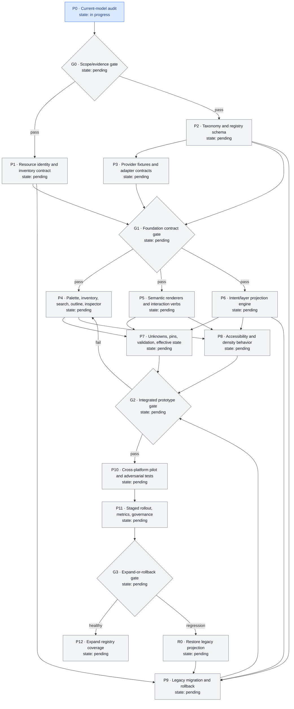

# Resource visibility development flow

This tracker implements the approved resource-inventory and intent-based diagram-projection design.

Progress states are `pending`, `in progress`, `blocked`, and `complete`. To update a package:

1. Change its `state:` text in the Mermaid node.
2. Move its node ID to the matching Mermaid class (`pending`, `inprogress`, `blocked`, or `complete`).
3. Change the corresponding ledger state.
4. Mark it `complete` only after the listed exit evidence is accepted.

Gate exit evidence must be accepted before work follows a `pass` edge. A completed package may reopen to `in progress` if a later gate invalidates its assumptions.

## Progress graph

## Work-package ledger

| ID | Scope | Dependencies | Exit evidence | State |
|---|---|---|---|---|
| `P0` | Audit actual resource, graph, persistence, catalog, import, and undo models | none | Evidence report; known/unknown boundary; representative legacy fixtures | in progress |
| `G0` | Confirm approved contract maps to the real product without invented APIs | P0 | Product/design/engineering scope approval | pending |
| `P1` | Define authoritative resource identity, inventory, diagram references, and save boundary | G0 | Entity/state model and persistence contract tests | pending |
| `P2` | Define taxonomy, projection classes, registry schema, versioning, and fallbacks | G0 | Validated schema, decision tree, and governance rules | pending |
| `P3` | Map provider semantics and build fixtures for Azure, AWS, GCP, M365, and Generic | P2 | Evidence-backed adapter contract and adversarial fixtures | pending |
| `G1` | Validate foundation contracts before UI implementation | P1, P2, P3 | Schema/fixture review; unknown fallback demonstrated | pending |
| `P4` | Design palette, Inventory, search, outline, inspector, and findability journeys | G1 | Prototype/spec; every hidden-resource journey succeeds | pending |
| `P5` | Specify/build nodes, boundaries, badges, overlays, typed edges, semantic verbs, and pins | G1 | Renderer/interaction contract tests; no invented ports | pending |
| `P6` | Specify/build intent presets, layer resolution, layout persistence, and view switching | G1 | Deterministic projection tests; lossless round trip | pending |
| `P7` | Implement unknown/import states, pin restrictions, validation, provenance, and effective state | P4, P5, P6 | Failure-path and safety suite passes | pending |
| `P8` | Implement keyboard, screen-reader, non-color, zoom, density, and focus behavior | P4, P5, P6 | Automated and manual accessibility evidence | pending |
| `P9` | Implement migration preview/journal, legacy compatibility, stop rules, and rollback | P1, P2, P6 | Golden migrations; zero resource loss; rollback rehearsal passes | pending |
| `G2` | Review integrated prototype and migration safety | P7, P8, P9 | Comprehension, accessibility, identity, and rollback thresholds pass | pending |
| `P10` | Pilot representative and adversarial cross-platform cases | G2 | All required scenarios pass or remain explicitly unsupported | pending |
| `P11` | Stage rollout with feature control, telemetry, registry review, and support runbook | P10 | Healthy pilot metrics and exercised rollback path | pending |
| `G3` | Decide expansion or rollback from rollout evidence | P11 | Signed decision against stop conditions | pending |
| `P12` | Expand provider/type coverage through governed registry changes | G3 healthy | Versioned conformance queue and ongoing quality dashboard | pending |
| `R0` | Restore legacy projection after material regression | G3 regression | Legacy view restored; inventory/provider state unchanged; incident evidence retained | pending |

## Current summary

- Pending: 17
- In progress: 1
- Blocked: 0
- Complete: 0
- Next package: `P0` — current-model audit
