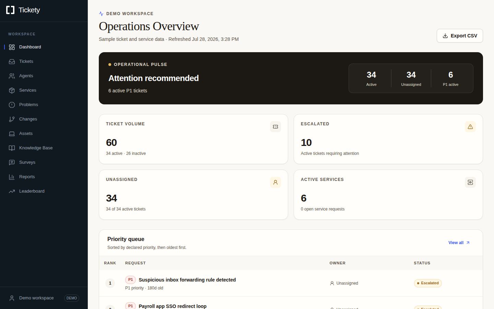
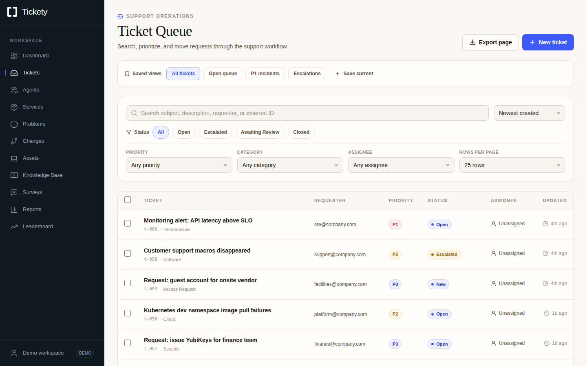
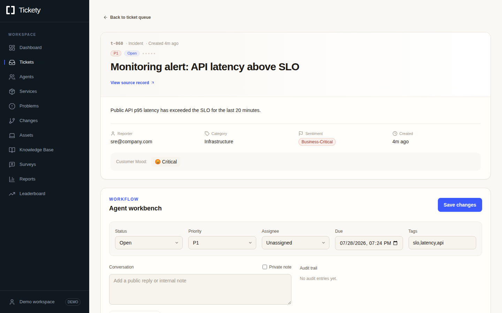
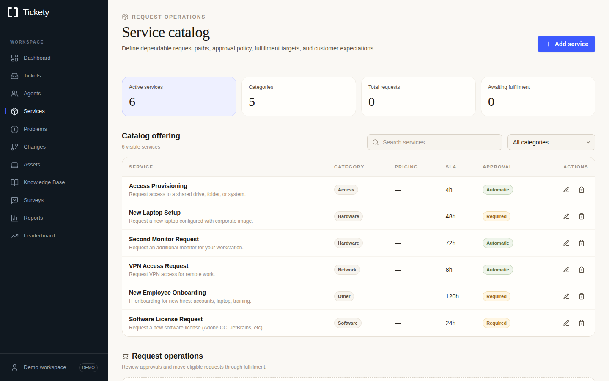
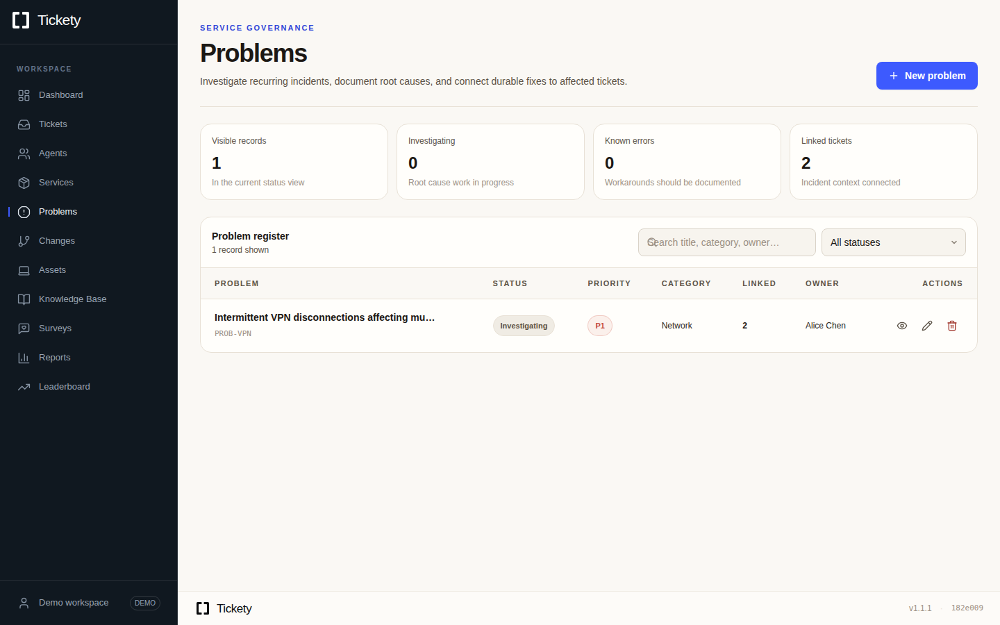
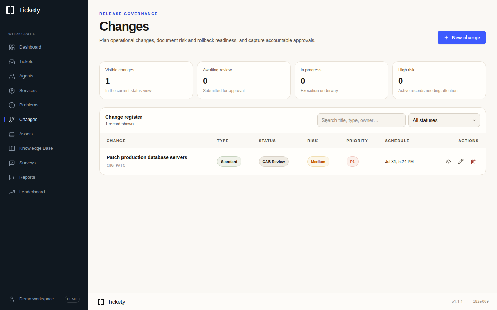
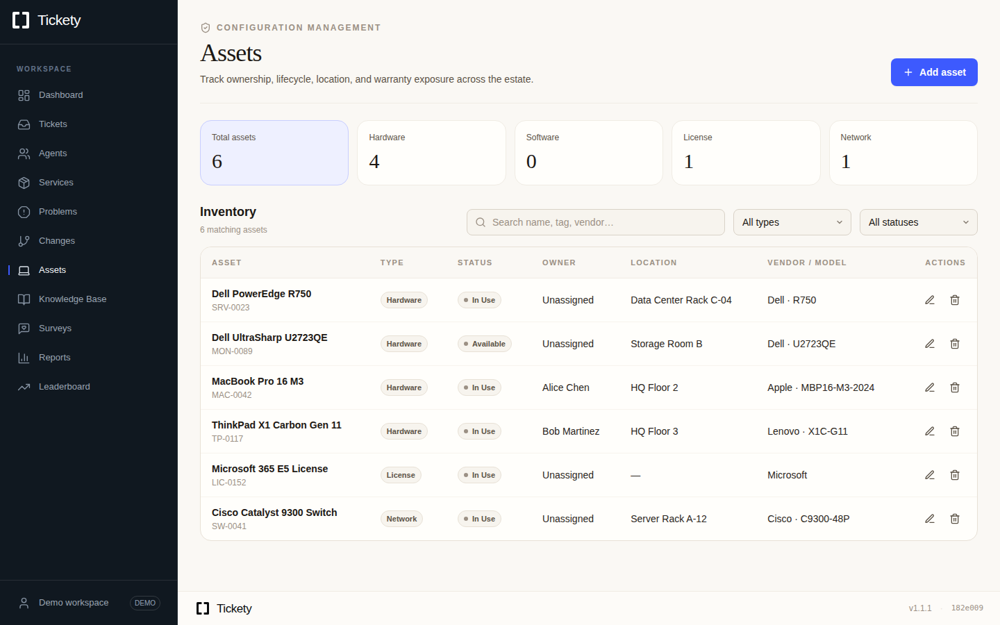
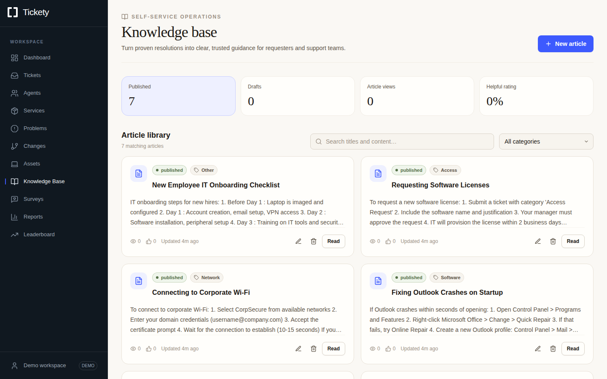
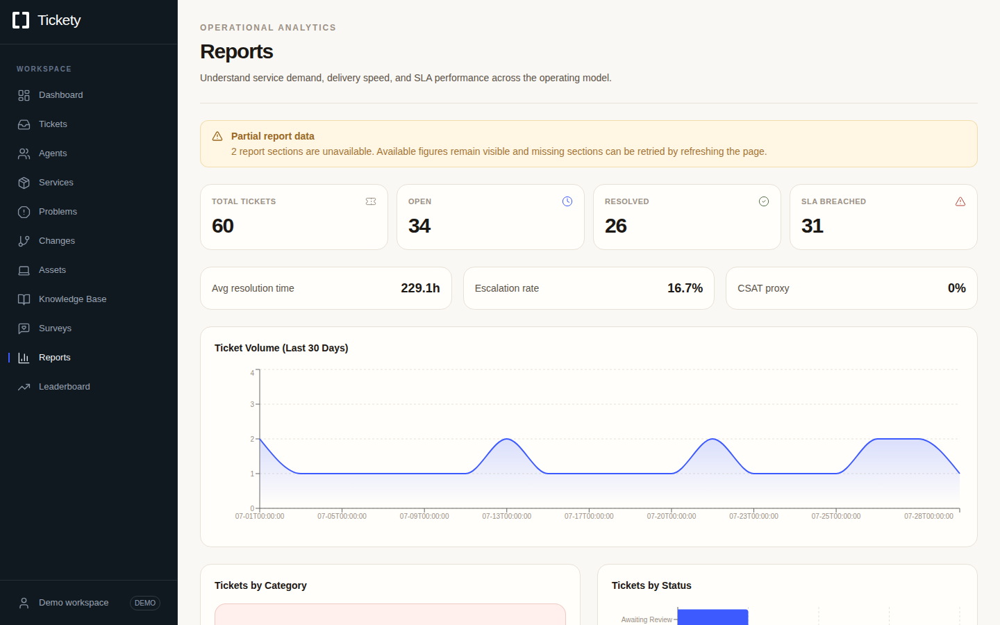
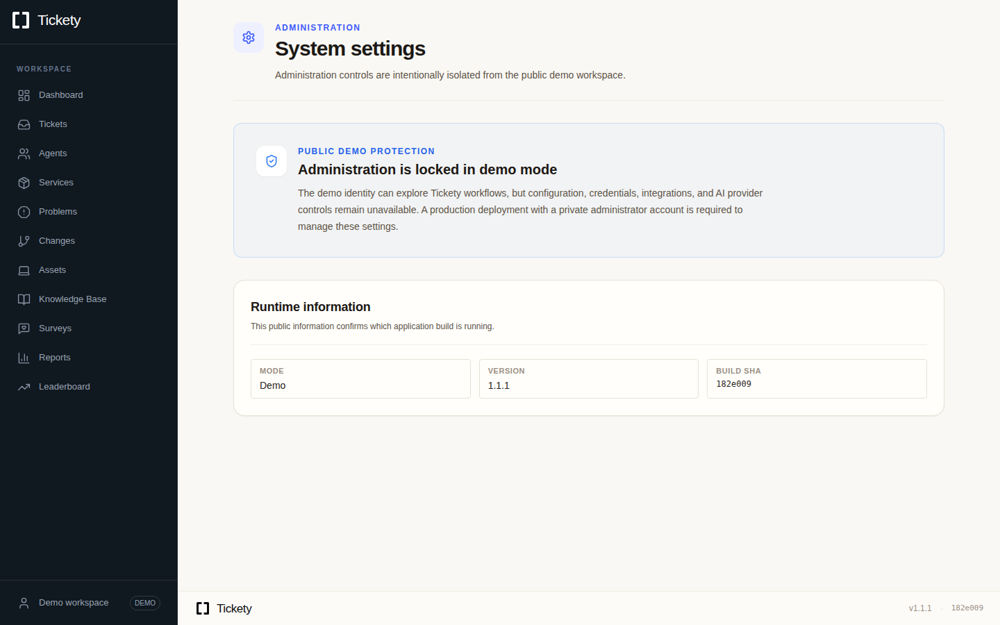

<div align="center">
  
  
  
</div>

---

Tickety — ITSM platform with built-in AI. Runs standalone or connects to an external provider.

## Screenshots

<p align="center">
  
  
  
  
  
  
  
  
  
  
</p>

## Stack

| Layer | Tech |
|---|---|
| Backend | Python 3.11 · FastAPI · SQLAlchemy · APScheduler |
| Frontend | Next.js 15.5 · Tailwind CSS · TanStack Query · Recharts |
| AI | LiteLLM (DeepSeek · OpenAI · OpenRouter · Azure · Custom) |
| Database | PostgreSQL |
| Infra | Docker Compose · Kubernetes · Helm · AKS |

## Quick start

Python dependencies are declared in `requirements.txt` and reproducibly pinned
in `requirements.lock`. CI and production images install the lock. After an
intentional dependency change, regenerate it with:

```bash
uv pip compile requirements.txt --universal --python-version 3.11 --output-file requirements.lock
```

```bash
./deploy.sh docker
open http://localhost:3000
```

This starts the demo configuration, including PostgreSQL and migrations. For
production Docker, Kubernetes/Helm, AKS/ACR, external PostgreSQL, upgrades, or
data-retention instructions, see the [deployment guide](docs/deployment.md).

> **Demo mode is on by default.** Public browsing does not require login. Sign in
> with the seeded administrator to configure the workspace and use protected AI,
> intelligence, integration, maintenance, ticket, and IAM features. Demo agents,
> supervisors, and the anonymous fallback remain blocked from those protected
> features.

**Default demo accounts** (also available for an explicit demo sign-in):
`alice@company.com` / `bob@company.com` / `carol@company.com` — password `tickety123`

Alice is the seeded demo administrator. Existing-user password changes are
disabled in demo mode; IAM administrators can still create users with an initial
password and manage profiles, roles, and account status. Automatic AI and
embedding workflows require `LOGIN_REQUIRED=true` in demo mode in addition to
their individual enable flags; explicitly requested admin operations remain
available without changing the public browsing mode.

## LLM Providers

Tickety supports **5 built-in providers** plus a **custom provider** for any OpenAI-compatible endpoint.

> **Recommended:** [DeepSeek](https://deepseek.com) offers the best price/performance ratio among all major providers — excellent triage and summarization quality at a fraction of the cost.

| Provider | Model format | Notes |
|---|---|---|
| **DeepSeek** | `deepseek-v4-flash`, `deepseek-v4-pro` | Best value — needs `DEEPSEEK_API_KEY` |
| **OpenAI** | `openai/gpt-4o`, `openai/gpt-4o-mini` | Needs `OPENAI_API_KEY`, optional `OPENAI_API_BASE` for proxies |
| **OpenRouter** | `openrouter/<model-id>` | Aggregates 200+ models — `OPENROUTER_API_KEY` |
| **Azure** | `azure/<deployment-name>` | Azure OpenAI — `AZURE_API_KEY` + `AZURE_API_BASE` + `AZURE_API_VERSION` |
| **Azure AI** | `azure_ai/<model-id>` | Models as a Service — `AZURE_AI_API_KEY` + `AZURE_AI_API_BASE` |
| **Custom** | `custom/<any-model>` | Any OpenAI-compatible API (vLLM, Ollama, Groq, Together AI, etc.) |

### Custom Provider

Configure any OpenAI-compatible endpoint with deployment environment/Secret
values. The production Settings page shows their effective masked state as
read-only; demo mode cannot dispatch AI requests:

| Setting | Description |
|---|---|
| Custom API Key | Your provider's API key |
| Custom API Base URL | Endpoint URL (e.g. `https://api.groq.com/openai/v1`) |
| LiteLLM Provider Type | Default `openai` — also supports `anthropic`, `gemini`, `groq`, `together_ai` etc. |
| API Version | Optional (e.g. `2024-10-21`) |
| Temperature | Optional 0–2 (e.g. `0.7`) |
| Max Tokens | Optional (e.g. `4096`) |
| Default Model | A provider-qualified identifier such as `custom/my-model`; unknown or blank identifiers are rejected. |
| **Fetch Latest Models** | Auto-discovers available models from your custom endpoint |

### Ticket Intelligence Retrieval

Tickety can maintain a pgvector-backed retrieval index for tickets, public
ticket comments, and knowledge-base articles. This keeps LLM analysis cheap: SQL and
vector search narrow the database first, then the LLM only sees a short context
set.

Embeddings are opt-in to avoid surprise token spend:

```bash
TICKET_EMBEDDING_ENABLED=true
TICKET_EMBEDDING_MODEL=openai/text-embedding-3-small
TICKET_EMBEDDING_DIMENSIONS=1536
TICKET_VECTOR_MIN_SCORE=0.25
```

After enabling embeddings, run `POST /ticket-intelligence/backfill` as an admin
to index existing records. Each call processes at most 500 records per source;
repeat it until `GET /ticket-intelligence/status` reports zero for
`legacy_ticket_documents`, `missing_ticket_documents`,
`missing_comment_documents`, and `missing_kb_documents`. New/updated tickets,
comments, synced tickets, and KB articles refresh or invalidate their documents
automatically. Private/internal comments are
excluded from external embeddings by default. Enabling
`TICKET_INDEX_PRIVATE_COMMENTS=true` is an explicit data-governance decision;
only published KB articles are indexed, and generated AI artifacts are never
treated as retrieval evidence. Embeddings share the same provider-wide
concurrency, request, token, and daily budgets as completions.

### AI reliability and cost controls

Every LLM task uses a strict output schema and a separate system policy that
treats ticket, KB, and retrieved text as untrusted evidence. Production fails
closed when a provider is missing, times out, or returns invalid output. Demo
mode can use local results only when `LLM_ALLOW_SYNTHETIC=true`; those artifacts
are persisted and displayed as synthetic. Generated escalation decisions
remain suggestions until a human applies the audited workflow action.
Automatic AI agents do not run in demo mode. In production they are opt-in;
set the specific `AUTO_*_ENABLED=true` controls only after authentication,
budgets, provider destinations, and egress policy are verified.
Anonymous self-service Portal tickets are never selected by the automatic AI
gap scanner. A scoped authenticated user must explicitly request analysis, or
an administrator/supervisor must explicitly queue it, before the worker may
send Portal content to an AI provider.

Analysis is keyed by ticket input, model, and pipeline version. A durable claim
prevents API and worker processes from paying for the same analysis, unchanged
requests reuse the cached result, and bulk repair endpoints queue bounded worker
jobs instead of holding an HTTP request open. Operational limits include:

```bash
LLM_REQUEST_TIMEOUT_SECONDS=30
LLM_OVERALL_TIMEOUT_SECONDS=90
LLM_MAX_PROMPT_CHARS=32000
LLM_MAX_CONCURRENCY=4
LLM_DAILY_TOKEN_BUDGET=500000
LLM_PROVIDER_REQUESTS_PER_MINUTE=120
LLM_PROVIDER_TOKENS_PER_MINUTE=250000
AI_PIPELINE_TIMEOUT_SECONDS=900
TICKET_EMBEDDING_MAX_COMMENTS_PER_REFRESH=50
AI_USER_REQUESTS_PER_MINUTE=10
AI_USER_REQUESTS_PER_DAY=200
ANALYTICS_USER_REQUESTS_PER_MINUTE=60
ANALYTICS_USER_REQUESTS_PER_DAY=5000
AI_INDEX_WRITES_PER_MINUTE=30
AI_INDEX_WRITES_PER_DAY=500
PORTAL_TICKETS_PER_MINUTE=5
PORTAL_TICKETS_PER_DAY=50
PORTAL_TICKETS_GLOBAL_PER_MINUTE=20
PORTAL_TICKETS_GLOBAL_PER_DAY=200
MAX_REQUEST_BODY_BYTES=1048576
AI_METRICS_RETENTION_DAYS=30
AI_ARTIFACT_RETENTION_DAYS=90
```

Provider concurrency uses expiring database-backed leases shared by API and
worker replicas; request and token ceilings are reserved before each retry.
Provider base URLs must use public HTTPS endpoints unless deployment-owned
private/insecure endpoint exceptions are deliberately enabled. In production,
Azure, custom, proxy, and embedding hosts must also be explicitly listed in
`LLM_ALLOWED_PROVIDER_HOSTS`; built-in OpenAI, OpenRouter, and DeepSeek hosts
are allowed by default. Prompt-free
latency, retry, token, failure, and synthetic-result counters are available to
admins and supervisors at `GET /admin/llm/metrics`.

Externally triggered AI, intelligence, provider settings, integrations, and AI
maintenance routes require a real authenticated session. In demo mode they are
limited to administrators; production retains its existing role permissions.
Demo fallback identities are never accepted on those routes. Provider-origin
changes also require the corresponding credential to be re-entered, preventing
an existing key from being silently forwarded to a new destination. External
webhooks are rejected unless `WEBHOOK_SECRET` is configured, the
`X-Freshservice-Webhook-Timestamp` is fresh, and the base64 HMAC-SHA256
signature matches `timestamp + "." + raw_body`. Signed deliveries are claimed
atomically so a captured request cannot be replayed.
OAuth callback state is likewise single-use, bounded, and charged to the
authenticated administrator's request budget before token exchange.

In production, credentials, provider/model routing, model and user budgets,
automation toggles, embedding destinations, ITSM provider destinations,
CORS/cookie/login controls, webhook controls, and SSO configuration are
deployment-owned environment/Secret values. Database overrides for those keys
are ignored, so a stale or previously compromised settings row cannot override
the reviewed deployment configuration after restart.

The Settings page displays the effective, masked state of those values but
makes their controls read-only in production. **Save Changes** submits only
application-managed settings; change deployment-managed fields in the workload
environment/Secret and roll out the affected workloads.

## Production mode

Tickety ships in **demo mode** for evaluation with anonymous read access and an
explicitly authenticated administrator feature path. Production remains the
required mode for private deployments and deployment-managed security controls.
Set deployment environment/Secret values before starting production workloads:

`APP_MODE` is deployment-owned and cannot be changed through the settings API.
Production mode never creates the fixed demo accounts or sample data, even if
an old `SEED_DEMO_DATA` override exists. On the first production startup,
repository-seeded demo users are deactivated, their known passwords are erased,
their sessions are revoked, and queued/running demo-era AI work is quarantined
for review. Provision a separate real admin or SSO identity before switching
traffic.

1. Set `APP_MODE=production`, `LOGIN_REQUIRED=true`, secure cookie settings,
   and an exact `CORS_ALLOW_ORIGINS` value in the deployment Secret.
2. Provision a non-demo administrator (or a reviewed SSO bootstrap path), then
   verify the documented demo credentials no longer work.
3. Optionally enable **SSO (OIDC)** — supports Google, Azure AD, Okta, and any OpenID Connect provider.

| Setting | What it does |
|---|---|
| Require Login | Controls whether users must sign in; configure it in the deployment environment/Secret. |
| Enable SSO | Enables OIDC-based Single Sign-On. It is deployment-managed in production. |
| SSO Provider Name | Display name shown on the SSO login button (e.g. "Google", "Okta"); deployment-managed in production. |
| Client ID / Secret | OIDC credentials from your identity provider; deployment-managed in production. |
| Discovery URL | Provider's `.well-known/openid-configuration` endpoint; deployment-managed in production. |
| Redirect URI | Must match the callback URL registered with your provider (e.g. `https://yourdomain.com/api/auth/sso/callback`); deployment-managed in production. |

### Background worker roles

Production API replicas do not run APScheduler. Scheduled external sync and AI
gap-filling jobs run in the dedicated `backend-worker` deployment, which has one
replica and uses a `Recreate` rollout so worker revisions never overlap. This
allows the `backend` API deployment to scale independently without duplicating
jobs.

The process role is controlled with `TICKETY_PROCESS_ROLE`:

| Value | Behaviour |
|---|---|
| `api` | Serve HTTP only; scheduled jobs are always disabled. |
| `worker` | Own scheduled jobs; use `python -m app.backend.worker`. |
| `all` | Combined API and scheduler process for local/demo use. |

When the variable is unset, production defaults to `api` and demo mode defaults
to `all`. `TICKETY_SCHEDULER_ENABLED=false` is an emergency kill switch for a
worker or combined process; setting it to true never grants scheduler ownership
to an `api` process. Sync intervals are bounded and controlled with
`SYNC_INTERVAL_SECONDS` and `AUTO_TRIAGE_INTERVAL_SECONDS`.

## Modules

| Module | Key features |
|---|---|
| Incidents | CRUD, comments (public/private), audit log, bulk ops, tags, custom statuses &mdash; fully triaged by AI pipeline |
| Problems | Root cause tracking, link/unlink incidents, workaround/resolution documentation |
| Changes | CAB approvals (approve/reject), risk assessment (Low/Medium/High), rollback and test plans |
| Service Catalog | Requestable items with category grouping, approval routing, fulfilment tracking |
| Assets / CMDB | Hardware, software, licence, network inventory &mdash; ownership, warranty, location, cost tracking |
| Knowledge Base | Markdown articles, full-text search, category/tag filtering, helpful/not-helpful feedback, ticket linking |
| Portal | Public ticket submission and status tracking by email &mdash; no login required |
| Surveys / CSAT | Post-resolution survey templates, rating distribution, response rate analytics |
| Time Tracking | Per-ticket time entries, daily/total summaries, filter by ticket or agent |
| Reports | Volume trends (AreaChart), category/status breakdown (PieChart/BarChart), SLA compliance, resolution-time charts |
| AI Pipeline | Auto-triage (sentiment/category/priority/mood/complexity) &rarr; auto-summarisation &rarr; auto-routing &rarr; auto-resolution plans |
| Ticket Intelligence | Optional pgvector-backed retrieval over tickets, comments, and KB articles for low-token LLM database analysis |
| SLA | Per-priority clocks, breach detection, escalation risk scoring, compliance reports |
| Engagement | Impact points, tier promotions (T1&ndash;T8), momentum streaks, recognition badges, leaderboard |
| Auth / RBAC | Cookie-based sessions, admin / supervisor / agent roles, login page, SSO (OIDC) |

## API

| Endpoint | Description |
|---|---|
| `GET /tickets` | List all tickets (filter by status, priority, assignee, category) |
| `POST /tickets` | Create ticket (auto-triaged by AI) |
| `PATCH /tickets/:id` | Update ticket status, assignee, priority etc. |
| `GET /tickets/:id/comments` | List comments (public and private) |
| `POST /tickets/:id/comments` | Add comment |
| `GET /tickets/:id/audit` | Audit log for a ticket |
| `POST /tickets/bulk` | Bulk assign/close/set priority/ set category |
| `GET /ticket-intelligence/search?q=...` | Retrieve the most relevant ticket/comment/KB snippets for a question |
| `POST /ticket-intelligence/analyze` | Ask an LLM a question using only retrieved ticket context |
| `POST /ticket-intelligence/backfill` | Admin: index existing tickets/comments/KB articles |
| `GET /problems` | List problems (filter by status) |
| `POST /problems` | Create problem record |
| `PATCH /problems/:id` | Update problem (status, root cause, resolution) |
| `POST /problems/:id/link/:ticket_id` | Link incident to problem |
| `GET /changes` | List change requests |
| `POST /changes` | Create change request |
| `PATCH /changes/:id` | Update change (status, risk, schedule) |
| `POST /changes/:id/approvals` | Add CAB approval |
| `PATCH /changes/:id/approvals/:aid` | Approve or reject change |
| `GET /assets` | List assets (filter by type, status, search) |
| `POST /assets` | Create asset record |
| `GET /kb` | Search knowledge base articles |
| `POST /kb` | Create article |
| `GET /services` | List service catalog items |
| `GET /service-requests` | List service requests |
| `POST /surveys/send` | Send CSAT survey for a resolved ticket |
| `GET /surveys/stats` | Survey response statistics |
| `POST /time-entries` | Log time on a ticket |
| `GET /reports/summary` | KPI dashboard data |
| `GET /reports/volume` | 30-day ticket volume |
| `GET /intelligence/alerts` | Escalation-prone tickets, SLA at-risk/breached |
| `GET /intelligence/systemic` | Systemic issue clusters |
| `GET /leaderboard` | Agent leaderboard (points, tier, rank) |
| `POST /auth/login` | Session login (cookie) |
| `POST /auth/logout` | Clear session |
| `GET /auth/sso/config` | Check if SSO is enabled |
| `GET /auth/sso/login` | Initiate OIDC login flow |
| `GET /auth/sso/callback` | OIDC provider callback |
| `GET /admin/settings` | List configuration keys |
| `PUT /admin/settings` | Update configuration |

## Settings

| Section | What you configure |
|---|---|
| LLM | Provider (DeepSeek/OpenAI/OpenRouter/Azure/Custom), default model, API keys, live model fetching |
| Ticketing mode | Standalone (built-in) or external ITSM provider |
| SLA targets | Resolution-time targets per priority (P1/P2/P3 hours) |
| Agents | Create and manage accounts, assign admin/supervisor/agent roles |
| Categories | Ticket classification categories with colour coding |
| Statuses | Custom ticket lifecycle statuses (open/terminal flags, sort order) |
| Priorities | Custom priority levels with per-priority SLA hours and sort weights |
| Organisation | Workspace name, logo URL, primary colour |
| AI Automation | Toggle: auto-triage, auto-summarisation, auto-routing, auto-resolution, systemic detection |
| Security & Auth | Require Login (production mode), SSO/OIDC (Google, Azure AD, Okta, generic) |
| Notifications | Enable/disable alert events (new ticket, SLA breach, escalation, assignment, comment) per channel (in-app/email/webhook) |
| Maintenance | Repair AI data gaps, retroactively triage untriaged tickets |

## Structure

```
app/
├── backend/
│   ├── main.py              FastAPI app + all endpoints
│   ├── database.py          SQLAlchemy models (20 tables)
│   ├── schema.py            Pydantic request/response models
│   ├── settings.py          DB-backed env override persistence
│   ├── sync_worker.py       Role-gated background scheduler lifecycle
│   ├── worker.py            Dedicated production scheduler entrypoint
│   ├── brain.py             LLM-powered ticket processor
│   ├── intelligence.py      AI agents (escalation, SLA, systemic, trends, routing)
│   ├── llm_manager.py       LiteLLM router + live model fetching
│   ├── prompts.py           Gamification rules and thresholds
│   ├── seed.py              Demo data (users, tickets, KB, config)
│   └── integrations/
│       ├── base.py           Abstract ITSM adapter interface
│       ├── freshservice.py   External provider adapter (REST + OAuth)
│       ├── jira.py           Jira Cloud adapter (REST + API token)
│       ├── registry.py       Adapter factory
│       └── sync.py           Ticket & agent sync logic
└── frontend-next/
    ├── app/
    │   ├── page.tsx           Dashboard
    │   ├── tickets/           List view + detail page
    │   ├── agents/            Agent CRUD + role management
    │   ├── services/          Service catalog
    │   ├── problems/          Problem management
    │   ├── changes/           Change management
    │   ├── assets/            Asset / CMDB
    │   ├── knowledge/         Knowledge base
    │   ├── surveys/           CSAT surveys
    │   ├── time/              Time tracking
    │   ├── portal/            Self-service portal
    │   ├── reports/           Reports & analytics
    │   ├── leaderboard/       Agent leaderboard
    │   ├── intelligence/      AI intelligence dashboard
    │   ├── settings/          System configuration
    │   ├── login/             Authentication
    │   └── profile/           User profile
    ├── components/
    │   ├── layout/            Sidebar, footer, logo, sync indicator
    │   ├── dashboard/         KPI cards
    │   ├── engagement/        Sentiment, momentum, recognitions, tiers
    │   ├── ticket/            AI stream, ticket list, modals
    │   └── ui/                Shared UI (searchable select)
    └── lib/                   API client, types, utilities, WebSocket, stores
k8s/                           Namespace, workloads, database, and secret setup guidance
```

Production schema changes use forward-only Alembic migrations. See
[Database migrations](docs/database-migrations.md) for deployment, backup, and
recovery expectations.

## License

MIT
